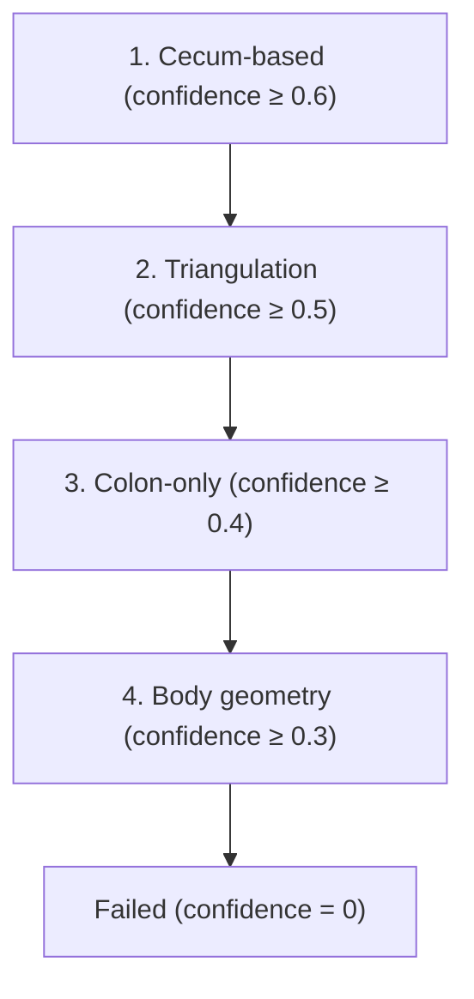

# Appendix / RLQ Extractor

`AppendixExtractor` detects appendicitis by localizing the **Right Lower Quadrant (RLQ)** and extracting inflammation-related features from the region. Since direct appendix segmentation is unreliable at CT resolution, a heuristic localization strategy is used.

**Required masks:** `organ_seg`, `body`

---

## Localization Strategy

The extractor attempts RLQ localization in priority order, stopping at the first method that achieves sufficient confidence:



---

### Method 1: Cecum-Based (Highest accuracy)

Requires colon segmentation volume between 50–1000 mL.

1. Filter colon to the **right side** (X > midline, i.e., right in RAS+)
2. Among right-side colon voxels, keep the **inferior 30% in Z** (cecum region)
3. Run connected-component analysis; take the **largest component**
4. Centroid of the largest component = RLQ center
5. Apply a **10 mm posterior shift in Y** (to account for retrocecal appendix location)

```python
right_colon = colon_coords where X > midline
cecum_region = right_colon where Z ≤ percentile(Z, 30)
largest_component_centroid → center_xyz
center_y -= 10mm / spacing_y   # posterior bias
```

Confidence: 0.60 base + up to 0.30 based on component size and fragmentation.

---

### Method 2: Triangulation (Anatomical landmarks)

Uses bony and muscular landmarks to estimate the RLQ:

- **Z range:** Hip/sacrum (inferior bound) to lumbar vertebrae (superior bound)
- **X/Y position:** Based on right iliopsoas, right iliac artery, or right kidney (mirrored from left if needed)
- **Target Z:** 30% of the way from inferior to superior bound

Confidence: up to 0.60 based on number of landmarks found.

---

### Method 3: Colon-Only

Fallback using only right-side + inferior colon voxels (rightmost 70th percentile X, bottom 30% Z). Connected-component centroid is used.

Confidence: fixed 0.55.

---

### Method 4: Body Geometry (Last resort)

RLQ estimated from overall body dimensions:

```
target_x = x_min + (x_max - x_min) × 0.70   # 70% from left = right side
target_y = (y_min + y_max) / 2
target_z = z_min + (z_max - z_min) × 0.25   # 25% from inferior
```

Confidence: fixed 0.35.

---

## Feature Extraction

Once the RLQ center is located, a **70 × 70 × 60 mm VOI** (Volume of Interest) is extracted. Features are computed within this VOI.

### Fat Stranding

Fat is defined as tissue in the HU range −150 to −30 that is not an organ:

```
fat_mask = is_fat_candidate & (-150 ≤ HU ≤ -30)
```

**Stranding:** Fat with HU > −70 (elevated fat density suggests inflammation):

```
stranding_fraction = count(fat where HU > -70) / count(fat)
```

**Normalization against subcutaneous fat:**
```
rlq_to_subcut_fat_ratio = rlq_fat_mean_hu - subcut_fat_mean_hu
```

Subcutaneous fat is sampled from the 10mm body surface ring, filtered to −120 to −80 HU.

---

### Free Fluid

```
fluid_mask = body_non_organ & (-10 ≤ HU < 25)
rlq_fluid_volume_cc = count(fluid_mask) × voxel_vol_cc
```

---

### Appendicolith (Calcification)

Calcifications adjacent to bowel lumen (potential appendicoliths):

1. Combine colon + small_bowel labels within VOI
2. Dilate bowel mask by 1 voxel
3. Find voxels with HU > 130 within the dilated zone

```
bowel_dilated = binary_dilation(colon | small_bowel, iterations=1)
stone_mask = bowel_dilated & (HU > 130)
```

---

### Bowel Wall HU

Bowel wall (via erosion) within the RLQ VOI, clipped to −50 to +150 HU.

---

## Full Feature Table

| Feature | Unit | Description |
|---------|------|-------------|
| `appendix_loc_confidence` | 0–1 | Localization confidence score |
| `appendix_loc_method` | string | Method used: cecum/triangulation/colon_only/body_geometry/failed |
| `center_x/y/z_vox` | voxels | RLQ center in voxel coordinates |
| `center_x/y/z_mm` | mm | RLQ center in mm |
| `box_size_x/y/z_mm` | mm | VOI box dimensions (default 70×70×60) |
| `rlq_fat_mean_hu` | HU | Mean fat HU in RLQ |
| `rlq_fat_std_hu` | HU | Std fat HU in RLQ |
| `rlq_fat_p10_hu` | HU | 10th percentile fat HU |
| `rlq_fat_p90_hu` | HU | 90th percentile fat HU |
| `rlq_stranding_volume_cc` | mL | Volume of fat > −70 HU (stranding) |
| `rlq_stranding_fraction` | fraction | Stranding fraction of RLQ fat |
| `rlq_to_subcut_fat_ratio` | HU | RLQ fat HU minus subcutaneous fat HU |
| `rlq_fluid_volume_cc` | mL | Free fluid volume in RLQ |
| `rlq_calcification_volume_cc` | mL | Appendicolith volume |
| `rlq_calcification_max_hu` | HU | Maximum HU of calcification |
| `rlq_bowel_wall_mean_hu` | HU | Mean bowel wall HU in RLQ |
| `rlq_bowel_wall_std_hu` | HU | Std bowel wall HU in RLQ |
