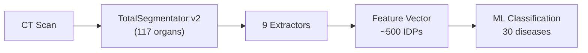

# Image-Derived Phenotypes

**PhenoCT** is a Python package for extracting comprehensive quantitative biomarkers from abdominal and thoracic CT scans using automated organ segmentation. It provides 9 specialized extractors covering the major organ systems, producing a structured set of **Image-Derived Phenotypes (IDPs)** suitable for machine learning and clinical research.

---

## What are Image-Derived Phenotypes?

Image-Derived Phenotypes are quantitative measurements automatically derived from medical images — without manual annotation of individual cases. Unlike traditional radiomics (which describes texture patterns within a lesion), IDPs measure **anatomically meaningful quantities**: organ volumes, vascular diameters, fluid accumulation, bone density, and more. These measurements directly correspond to findings that radiologists describe in clinical reports.

---

## Feature Extractors

| Extractor | Organ System | Clinical Focus |
|-----------|-------------|---------------|
| [Organ Morphology](extractors/organ-morphology.md) | All organs | Volume, shape, HU statistics |
| [Cardiothoracic](extractors/cardiothoracic.md) | Heart & Lungs | Atelectasis, mediastinum |
| [Hepatobiliary](extractors/hepatobiliary.md) | Liver, GB, Bile ducts | CBD diameter, fat stranding, IHD |
| [Vascular](extractors/vascular.md) | Aorta, IVC, Portal vein | Diameter, calcification, thrombosis |
| [Bowel](extractors/bowel.md) | GI tract | SBO diameter, hiatal hernia, wall HU |
| [Fluid & Gas](extractors/fluid-gas.md) | Body cavities | Ascites, effusion, pneumoperitoneum |
| [Bone](extractors/bone.md) | Spine (T1–L5) | BMD proxy, compression fractures |
| [Kidney](extractors/kidney.md) | Kidneys | Cysts, hydronephrosis, asymmetry |
| [Appendix / RLQ](extractors/appendix.md) | Right lower quadrant | Appendicitis fat stranding, fluid |

---

## Quick Links

- :material-book-open-outline: **[Getting Started](getting-started.md)**

    Install the package and process your first case in minutes.

- :material-table: **[Feature Reference](feature-reference.md)**

    Complete table of all ~500 feature names with units and descriptions.

- :material-code-braces: **[Extractors Overview](extractors/index.md)**

    Architecture and design principles of the extractor system.

---

## Segmentation Model

All extractors assume **TotalSegmentator v2** segmentation output in **RAS+ orientation** (Right–Anterior–Superior), loaded via nibabel's `as_closest_canonical()`.

- Axis 0 (X): Left → Right
- Axis 1 (Y): Posterior → Anterior
- Axis 2 (Z): Inferior → Superior
